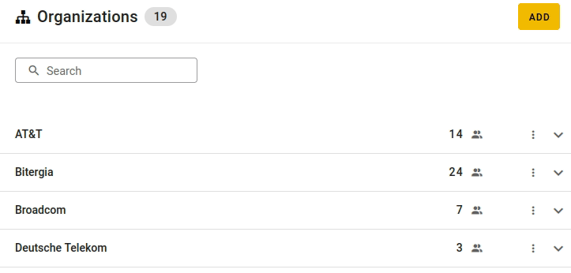
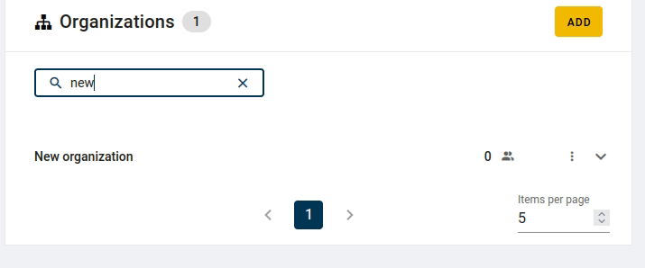
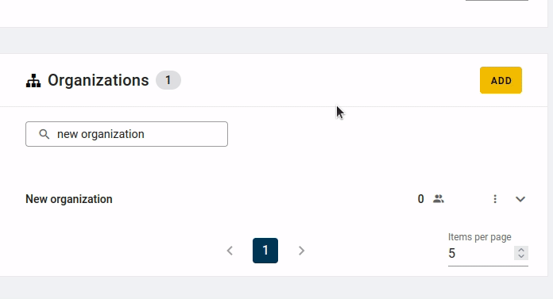
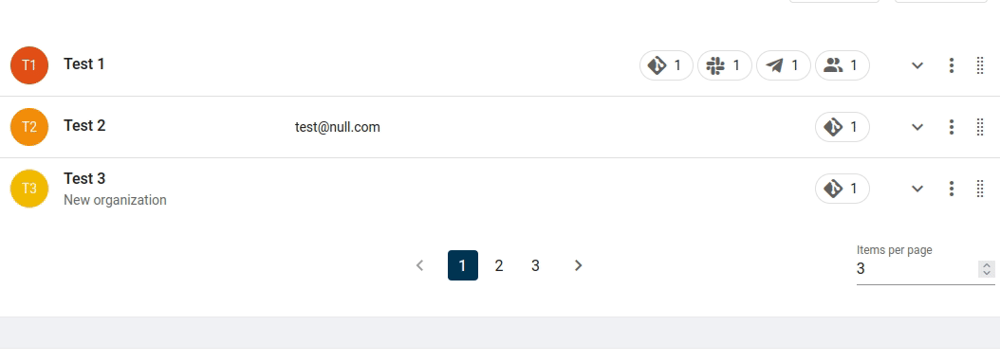
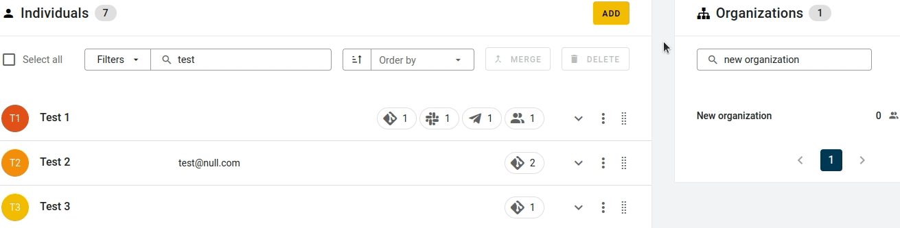
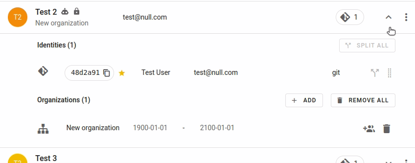

# Affiliations

## What are Affiliations?

An enrollment is time-bound assignment of an individal to an organization. You can add,
update, or fix one or more enrollments to a given identity/individual. The
contributions from the affiliated individual will be updated in BAP by setting the
organization name as the value in the field: `author_org_name`.

Be careful with overlapping enrollments\! If two or more enrollments are overlapping in
the same time period, the enriched index will contain one of them in the
`author_org_name` field.

## Why are they important?

The affiliations data set is one of the key parts of the Bitergia Analytics Platform.
Here you will find the information to modify the information about specific contributors
or organizations.

The huge variety of tools used by software development communities makes really difficult
any analysis. It is not enough to measure the activity in the code, issues, Q&A forums,
mailing lists, etc. Without having a way to connect the activity of the contributors
in the different tools (data sources as we call them) it will not be possible to offer
high quality metrics. Just as an example, the three metrics below are only possible by
having the affiliations data set:

  - Total number of contributors of a community. If your team members are using
    GitHub and Jira, are you sure you are not counting them twice?
  - Impact of an organization/company in the project. To get this metric you need the
    link between community members and organizations.
  - Retention rate of your contributors. How can you tell that someone is new to the
    community if you do not have a way to identify people using different accounts?

## Affiliations Editor

Identities are collected and stored by the Bitergia Analytics Platform. In case you want
to improve the quality of the data set you will need to use the affiliations editor
(SortingHat).
Find below the typical actions our customers perform to achieve it.

The most common issue is to have some of the organizations under-represented. Follow
the steps below to fix this:

  - Go to the `Affiliations` dashboard.
  - Select the organization `Unknown` in any of the two pie charts. Organizations are
    shown in the inner circle.
  - Identify the domains that should be associated to an organization.
  - Open the identities editor. It will be available at `https://[INSTANCE].biterg.io/identities`.
  - Go to the `Organizations` table on the right side and search for the one you are missing.
  - If you do not find it, [add that organization](#adding-a-new-organization) to the
    database.
  - If you find it, [extend the information available for that organization](#adding-an-e-mail-domain-to-an-organization).
  - When the domain is added to the organization a process will refresh the metrics you
    see on the dashboards. This takes a couple of hours.

### Adding a new organization

An organization can be added via SortingHat which will be available at
`https://[INSTANCE].biterg.io/identities`.

Click the `ADD` button on the top right corner of the `Organizations` table to add an
organization.

To add auto affiliation you have to add the base domain of the organization. Marking the 
domain as `top domain` also will also auto affiliate using its subdomains.

### Removing an organization

Organizations can be removed via SortingHat. Note that all the enrollments of contributors
affiliated to the deleted organization will be lost.
Go to the `Organizations` table on the main page, and use the `Search` box to look for an
organization. Click on the button with the three dots on the right side of the
organization and then select `Delete organization` on the dropdown menu.

### Adding an e-mail domain to an organization

The platform can map email domains to organizations. By doing that every identity with
any of those mapped domains will be associated to the proper organization.

On the `Organizations` table, use the `Search` box to look for an organization.
For each organization you want to update, click the three dot button and select the button
`View/edit domins` to add/remove the organization domains.

### Enrolling a person to an organization

Search for the user using the `Search` box on the `Individuals` table, and click on the 
button with the chevron icon next to the user to expand it. Then, click the `ADD` button 
next to `Organizations`. On the pop up you can link the profile to an organization and
set the start and end dates.

Alternatively, you can use drag and drop to enroll a person to an organization. 
Search for the contributor on the `Individuals` table and for the organization on the 
`Organizations` table. Grab the user with your mouse and release it over the organization
or viceversa. After that, a pop up will let you set the start and end dates.

### Un-enrolling a person from an organization

Expand the contributor's information and click on the button with the trashcan icon next 
to the organization you want to remove. To un-enroll the person from all the 
organizations to which they are affiliated, click `REMOVE ALL`.

### Preventing that affiliations removed from a contributor are restored

If you changed the affiliation for some contributors and you discover the changes were
restored, you can try the following. Instead of removing an organization automatically
added to the contributor, change its timeframe. For instance, you can set the enrollment
from 1900-01-01 to 1900-01-02, thus there will not be any data containing that
enrollment.

### How dates work

Dates are by default set to the beginning of the day, i.e. `00:00:00`.
Thus, we should setting the periods as:

  - `Organization A`: `1900-01-01` to `2019-10-01`
  - `Organization B`: `2019-10-01` to `2100-01-01`

Because end date for `Organization A` will be set under the hood as `2019-10-01 00:00:00`
(not inclusive) and start date for `Organization B` will be set as `2019-10-01 00:00:00`
(inclusive).

So `2019-10-01` will be the first day
that profile is enrolled to `Organization B` and `2019-09-30` will be the last day of
that profile enrolled to `Organization A`.

It could be summarized as the following condition, where `date` is the date to check
and decide the enrollment: `start_date <= date < end_date`.

## Prioritizing manual affiliations

Once the supporting domain driven auto-affiliation and recommendation jobs have been
applied, affiliations can be investigated and updated manually. This is usually a huge
manual workload, so a correct prioritization can help to maximize the impact of this
effort.

Contributions follow the Pareto principle: There's a statistical long-tail distribution
with a small subset of top contributors and a long set of less relevant casual
contributors. Affiliating small numbers of active contributors we may affiliate a lot of
contributions.

The Affiliations dashboard provides a ranking of top contributors with links to their
SortingHat profiles, plus several other affiliation-related visualizations that help
to filter the ranking and focus on the targeted contributors (e.g. by organization, by
domain, by data-source, time-frame, etc).

### Review all the unaffiliated domains

  1. Open the Affiliations dashboard and set a desired timeframe.
  1. Start filtering by the `Unknown` organization. Pin it, as we may need to jump to
     other visualizations.
  1. Focus on the pie chart with contributions by Organizations and Domains. The list of
     domains there should be generic (gmail.com is a good example).
  1. Visit the domains that do not seem to be generic. If the website that appears
     belongs to a company, you have to add this domain to the Organization/Company in
     SortingHat. Be careful, as some domains could belong to a free service provided by a
     company. This is common when we see mail providers common in other regions of the
     world.
  1. At this point, all the domains you identified as companies or organizations should
     be included in SortingHat.

When the affiliation process by SortingHat finishes, review this again. Wait to start
going contributor by contributor until this is finished.

### Review the most relevant unaffiliated contributors

  1. Open the Affiliations dashboard and set a desired timeframe.
  1. Start filtering by the Unknown organization. Pin it, as we may need to jump to other
     visualizations.
  1. Focus on the table below with all the contributors. Start reviewing the ones with
     the most contributions by clicking on the link "Go to SortingHat." The goal is to
     ensure we do not have information to assign to an organization or company.
  1. Depending on your time, you can go for the quick wins or look for more information on
     their [GitHub](https://github.com) or [LinkedIn](https://linkedin.com) profiles.
     Github's profile sometimes has a current affiliation (it doesn't have
     start or end dates) and sometimes it also provides a link to the corresponding
     LinkedIn profile. LinkedIn usually provides the whole affiliation history.

### Track Known Unknowns

For some contributors you may not discover their affiliation. To remember that you already checked them, consider assigning them to a dummy-organization. This could be called `Known-Unknown`. This can save you time later by avoiding to try to find affiliations for the same contributors, again and again.

## Troubleshooting

### Contributor activity is labeled with a single company when she/he is enrolled with more companies

When two enrollments overlap in time, the system will use one of them to update the
enriched information on the dashboard. That means that only one of them will be visible.
In case you detect identities with overlapping dates edit them so the profile is not
enrolled to more than one company at the same time.

### Changes are not visible in the metrics dashboard

Changes performed over the identities database need to be synchronized with the metrics
data set.

For each data source (e.g., git, mboxes) there are 3 main phases: collection, enrichment
and identities refresh. The last one takes care of synchronizing the data stored in
OpenSearch with the one available in SortingHat. The time to perform the 3 steps
depends on the amount of data available in the data source, however it generally takes
less than 3 hours.
