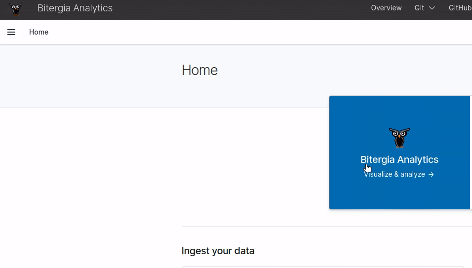

# Explore

## Inspecting an index from the web user interface

An index can be queried from the web user interface via the `Discover` applet. To access
this applet, open the left sidebar at the top left corner, just below the owl logo
and click on `Discover`.

