# SortingHat

SortingHat maintains a database of identities of community members across
different sources. An identity is a combination of a name, email, username and the source
from where it was extracted. Identities corresponding to the same real person can be
merged into one single individual with one unique profile.

## Unify a contributor's identities

### Merging different identities

You can merge all the different identities of a contributor using SortingHat, which will
be available at `https://[INSTANCE].biterg.io/identities`.

Search for the identities using the `Search` box in the `Individuals` section. To merge
one identity into another, select it on the table and drag it with your cursor into the
target profile. You can select and drag several items at once. 

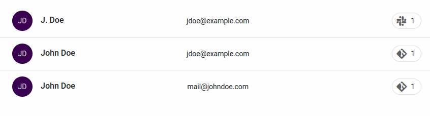

Alternatively, you can click to select the identities and then click the `MERGE` button
on the top right of the `Individuals` table to unify them. This method does not allow you
to choose the main identity.

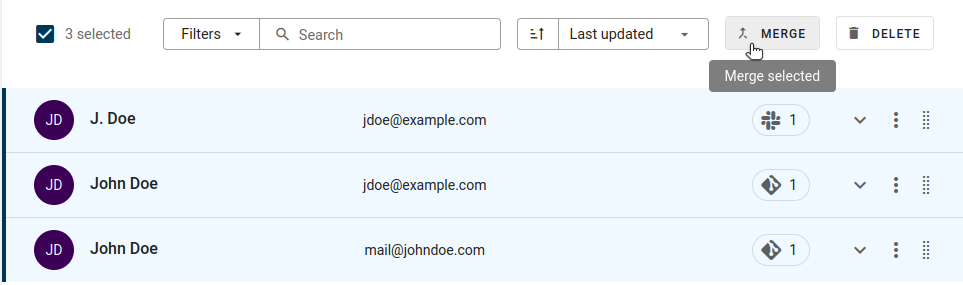

### Splitting identities

If an identity was wrongly assigned to a contributor, you can take it out of that profile
or "split" it. To do that, expand the profile on the `Individuals` table and click the
button with the diverging arrows next to the identity you want to split.

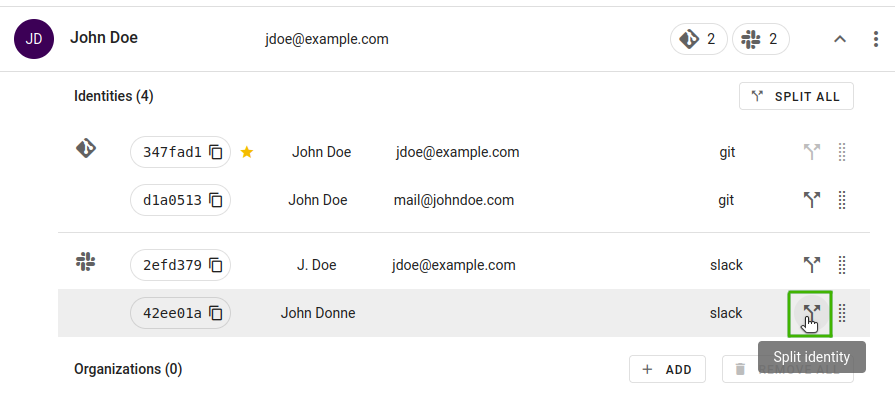

To split all the identities from a profile at once, click the `SPLIT ALL` button above
the list of identities. This will create a unique profile for each identity.

### Finding identity matches

To look for identities that belong to a contributor, use the `Search` box on the
`Individuals` table in SortingHat. If the contributor uses different names, emails or
usernames they may all not be findable in one single search. In that case, you can pin
the identities in the `Workspace` to keep track of all of them. To pin a profile, select
it with the cursor and drag it to the `Workspace` area or select `Save in workspace` on
the profile's menu.

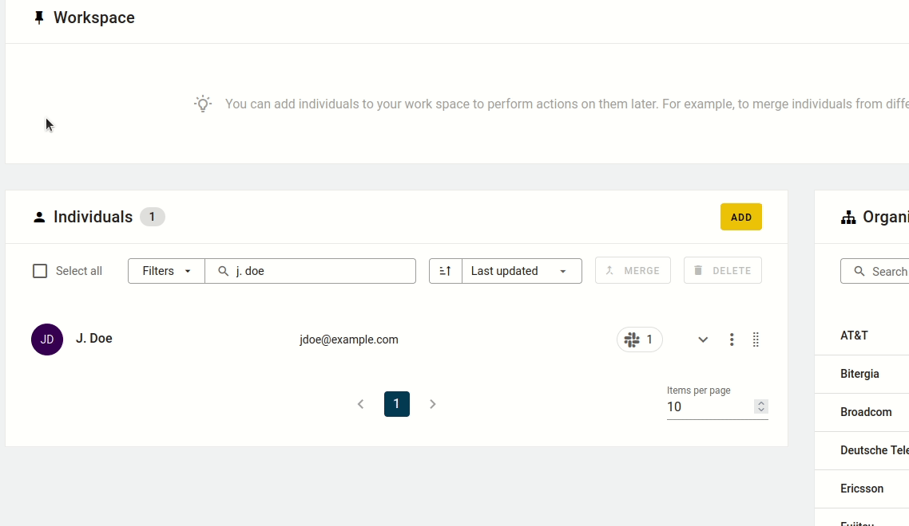

You can then keep searching for identities and merge them with the pinned profiles using
drag and drop, or saving them on the `Workspace` and clicking the `MERGE` button on the
top right.

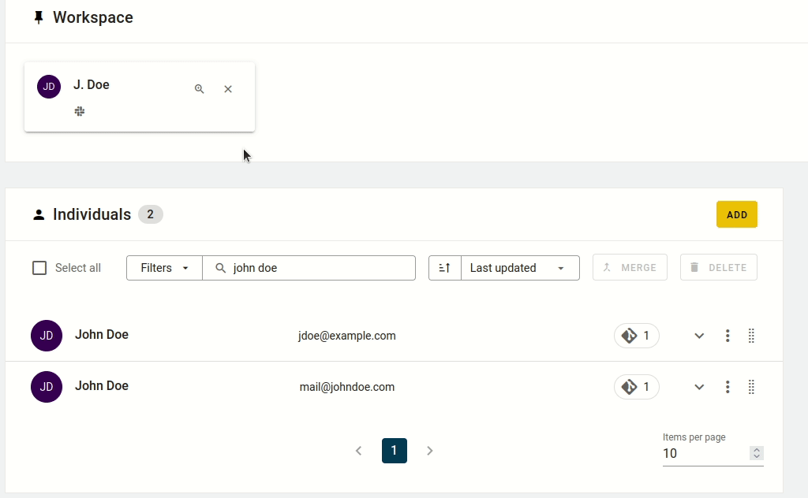

This is a somewhat time consuming process. To automate it, you can ask SortingHat to
recommend possible matches based on a profile's names, usernames and/or emails. Click
on a contributor's name to open their full profile, and then click the `FIND MATCHES`
button on the upper part of the page. It will open a form where the recommendation
settings can be changed and confirmed.

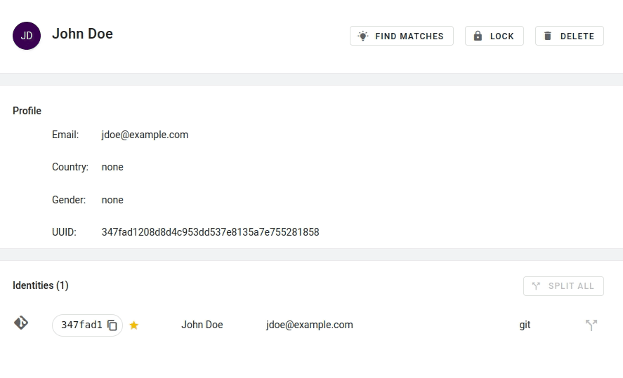

The process to look for recommendations automatically may take some time. When it has
finished, the profile page will show recommended identities that can be merged or, if
they don't belong to that profile, dismissed.

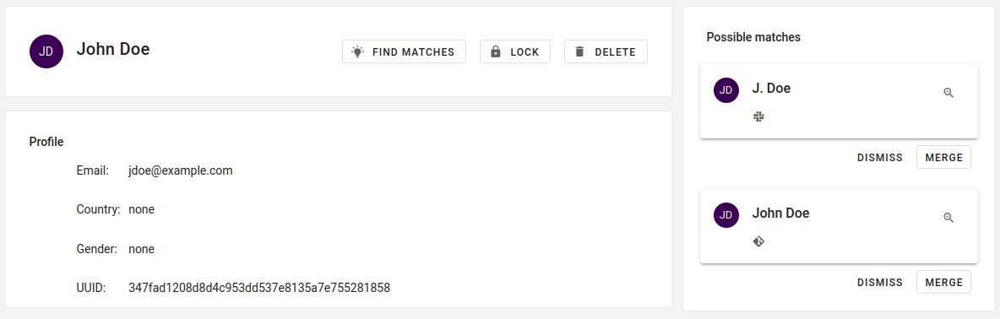

To review all of the generated recommendations at once instead of opening each
contributor's profile, click on the `# RECOMMENDATIONS` button above the `Individuals`
table. It will open a pop up where every suggested match can be applied or dismissed.

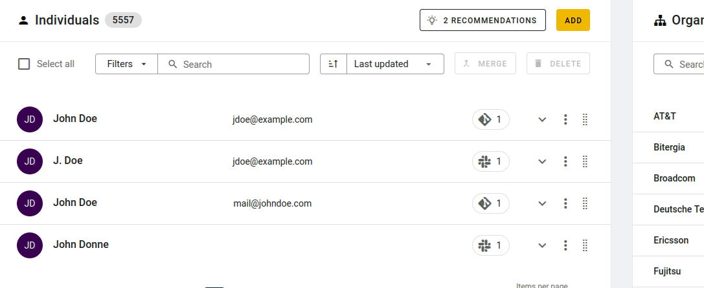

## Manage profiles

### Editing profile data

A contributor's name and main email can be edited, and information about their country
and gender can be added. Click on the contributor's name on the `Individuals` table to
open the member's full profile. To edit one of these fields, put the cursor over it to
reveal a pencil button and click it to enter edit mode. 

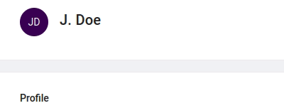

### Marking bots

There is an option to mark an identity as bot. This is available in the `Individuals`
section in SortingHat. This helps to filter out automated activity in the dashboard while
keeping such information in the database.

Search the identity that you want to mark as bot and click on the button with a robot 
icon next to the name.

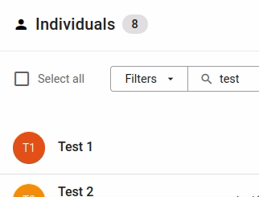

### Locking a profile

Profiles can be locked to make them read-only. To lock a profile, place the cursor over
the contributor's name in the `Individuals` section in SortingHat and click the button
with a lock icon. Clicking that button a second time unlocks the profile.

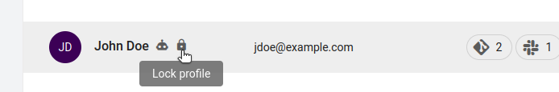

### Marking a profile as reviewed

To mark a profile as reviewed, click on the button with a check icon labelled as `Mark
as reviewed` on top of the contributor's profile.

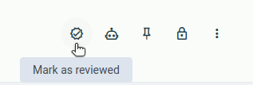

Put the cursor over the button to look up the review date of a profile.

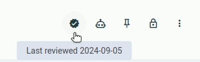

If there have been any changes in the profile since it was reviewed, the button will
display a warning icon. Clicking the button again updates the review date and removes
the warning.

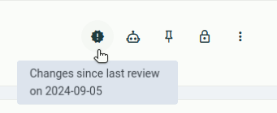

## Jobs

Priviledged users can schedule and trigger bulk data-processing jobs.

This automation is powerful, but also mostly irreversible, and therefore potentially
dangerous, as accidents might result in data corruption, which is sometimes very
difficult to fix and very time-consuming in both in corrections and checks. For this
reason, these automations need special permissions to be run.

But in order to request these jobs to be run, you need to understand them.

Currently there are several job types available:

  - **Affiliate**: Affiliate individuals to organizations using their e-mail domains.
  - **Genderize**: Autocomplete the gender information of indivivuals using
    [genderize.io](https://genderize.io/) recommendations.
  - **Recommend matches**: Recommend identity matches for individuals.
  - **Unify**: Unify individuals by using matching recommendations.

All of these jobs can be triggered by the user. **Affiliate** and **Unify** can also be
scheduled to be automatically run regularily. Both triggered and scheduled jobs accept
some configurations. These are different for each type of job. The schedules can be
enabled and disabled for each job type. Currently a single schedule per job type is
allowed.

You'll find all this in the `Settings` button on the top menu. The `General` subsection
on the left will allow the user to tweak and schedule the regular jobs. The `Jobs`
subsection is for manual triggered jobs.

### Types of matching

There are three types of matching that will allow the system to unify identities:
`email`, `name`, `username`.

  - `email`: same email address.
  - `name`: same full name.
  - `username`: same username of any source.

#### When to use each type of matching

**Email matching** - Most reliable. Use when contributors have consistent email addresses
across platforms.

**Name matching** - Least reliable. Only use when you are sure contributors keep the same
name but change emails. Could lead to snowballs (when common names incorrectly merge
multiple different people into one identity).

**Username matching** - Use when contributors maintain consistent usernames. Be cautious
of false positives.

### Interactions

There's a single matching recommendations list. Each run of a _Recommended matches job_
might add recommendations to the list.

Identity matching and unification are 2 steps of the same process. This is meant so the
user to run agressive matching policies and manually tune the results before applying
them.

But be aware that if you manually run a `Recommended matches` job, the next scheduled
`Unify` job will apply the recommendations. Disable the schedule if you have not yet
finished your manual tuning of the recommendations!

## Prioritizing manual identity improvements

Contributions to Open Source projects follow the Pareto distribution, so by focusing on
the most relevant contributors we significantly impact data quality.

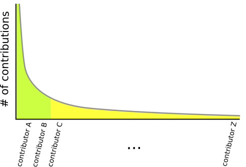

The image above shows a power law of Pareto distribution. The Y-axis represents the
number of contributions, and the X-axis contains the different contributors ordered by
number of contributions. Two colors represent two areas:

  - Green represents the head, where we have the most active contributors.
  - Yellow represents the long tail, where we have the vast majority of the community,
    with a small percentage of the overall activity.

Communities are huge sometimes, so it is essential to start improving the data set by
paying attention to the head of the Pareto distribution. Bitergia Analytics Platform
provides the Affiliations dashboard, which facilitates the work:

  - A visualization ranks the top contributors providing links to their SortingHat
    profiles. Top contributors are also the most likely to have several identities.
  - Several other visualizations facilitates filtering and focusing on specific
    organizations, domains, data sources or other interesting statistical populations.

## Basic Terminology

### SortingHat

The component from GrimoireLab/Bitergia Analytics to perform the identity management.

### Organization

Organizations that play special roles in open source software. We focus on two main types:

  - Foundations: non-profit organizations. Examples: The Apache Software Foundation, The 
    Linux Foundation, The Free Sofware Foundation.
  - Companies: legally recognized organizations that conducts business activities.

### Individual

The entity representing a contributor in SortingHat, including the related profile, 
identities, and enrollments.

Individuals are typically people but sometimes they are bots (see section on bots below).

### Identity

Each account the individual has on a data source. Most individuals have an identity per 
data source. Most individuals don’t have accounts in every tracked data source. Some 
individuals have several accounts in some data sources. Changes in the accounts (like 
name corrections) generate new identities.

### UUID

The unique identifier for a given individual. This is a long alphanumeric string and it
is used to track all the contributions from that individual across the enriched indexes. 
Also, it is used to build links from the dashboard to the corresponding identity profiles
in SortingHat. The corresponding field in BAP's enriched indexes is `author_uuid`.

### Enrollments

When an individual gets assigned to a given organization. Each enrollment has a start and 
an end date. If no dates are provided, the default dates will cover all history (from
year 1900 to 2100).

The organization field in BAP's enriched items (`author_org_name`) created by a given 
individual will be tagged according to the enrollments, taking into account the dates.

Each organization will have at least a name. Optionally, it can be linked to one or more 
domain.

For instance, the organization “Bitergia” could include the domain “bitergia.com.” 
SortingHat has mechanisms to add enrollments automatically when a known domain is found. 
For example, if a contributor submits a commit with a “bitergia.com” email, it can be
automatically affiliated to the organization “Bitergia.”

### Unknown

When a given individual has no enrollment in a given period in SortingHat, the value of
the `author_org_name` field is set to `Unknown` in BAP's enriched indexes. This is why we
use as common jargon the term “Unknowns” \- identities with no associated organization \-.

To get the identities/individuals that need to be affiliated, we apply the filter
`author_org_name: Unknown` in BAP.

### Bot

Some identities/individuals belong to automatic accounts, also known as “Bots.” Flagging
these accounts will help filter out the activity not produced directly by humans.

SortingHat allows to mark an identity as “Bot” and then the enriched indexes get updated
with a boolean value (true or false) in the `author_bot` field.

### Refreshed identities

For each change in SortingHat, it takes some time for the affected data in the dashboards
to get updated. How much time depends on the size of the SortingHat database, the number
of affected documents, and the size of the OpenSearch indexes. 

Normally, the changes are propagated in one or two hours.
