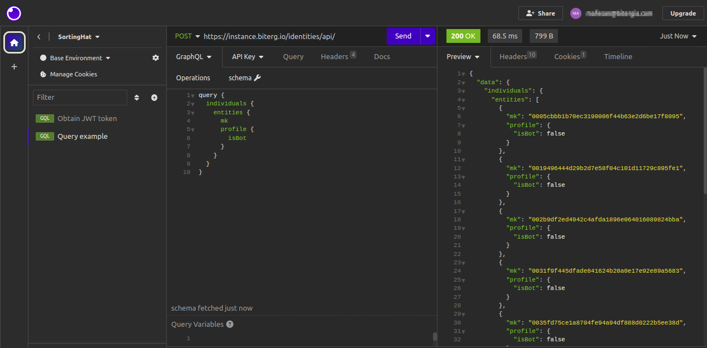
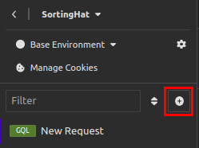
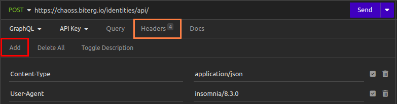
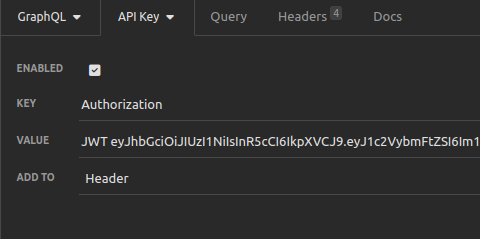
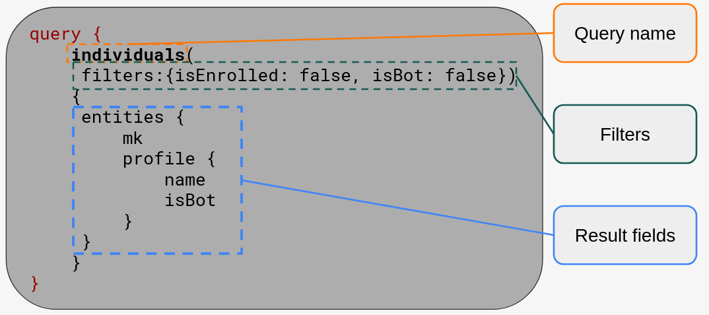
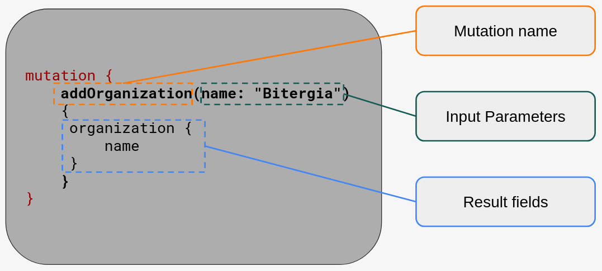

# SortingHat API

The SortingHat API provides a way to interact with SortingHat's data and
operations using GraphQL, an open-source data query and manipulation language.

Through this API, we can obtain information stored in SortingHat's database and
also, we can perform operations, such as adding, modifying, and removing
information about individuals and their enrollments, among others.

This first-steps tutorial aims to provide an introduction to SortingHat's
GraphQL API, how to set up a client and some examples of the queries and the
mutations supported by SortingHat's API.

The requests to a GraphQL API can be divided into two groups: **queries** and
**mutations**. Queries are focused on fetching data, while mutations are
requests executing operations adding, removing or modifying items in the
identities database.




## Setting up the client

To use the SortingHat API, we need to set up a GraphQL client: either a
library or a tool with a graphic interface. We propose using Insomnia, an
open-source desktop application that combines an easy-to-use interface with
advanced functionality like authentication helpers, code generation, and
environment variables.

For interacting with SortingHat API, we need to set up our client properly,
including the authentication.

Our communication with SortingHat API will be made through HTTPS requests. In
these requests, we must include some headers for interacting with the internal
Django server and the authentication part of SortingHat.

We are listing the headers we must include in the following table:

| **Header**     | **Value**                                 |
| -------------- | ----------------------------------------- |
| Referer        | `https://<instance name>/identities/api/` |
| Authentication | `JWT <token>`                             |

In a later section, we are providing examples of how to include these headers
and its content using Insomnia.

### Installing Insomnia

The instructions to install Insomnia in your system are available
[here](https://docs.insomnia.rest/insomnia/install). If you have **snap** in
your system, you can run the following command to install it:

```bash
sudo snap install insomnia
```

The tool will ask for an account. You can log in using your Google or GitHub
account too.

### Configuring headers in Insomnia

Open Insomnia and set the API URL, which is the name of the instance, plus
`/identities/api/`. For instance, for https://chaoss.biterg.io, the API URL will
be: `https://chaoss.biterg.io/identities/api/`.

Create a new **GraphQL request** by clicking the `+` button:



Then, go to the `Headers` tab and click on `Add`.



#### Referer

The "Referer" header must be set to the API URL. As explained above, the API URL
is the name of the instance, plus `/identities/api`. For instance, for
https://chaoss.biterg.io, the API URL will be:
`https://chaoss.biterg.io/identities/api`.

#### Authentication

To make authenticated requests, we need to obtain a JSON Web Token, that is
provided by the API.

We need to execute a mutation to obtain our access token. To do so, go to the
"GraphQL" tab, and copy the following request, replacing the values with your
access credentials to SortingHat:

```
mutation {
	tokenAuth(username: "my-username",
		  password: "*****"){
		token
	}
}
```

Then, we click on "Send", and if everything goes well, SortingHat will return
our token. The response should be similar to this one:

```json
{
	"data": {
		"tokenAuth": {
			"token": "eyJhbv2OTgzMTIxMzl9.aNn9tjUpXdUdSGokXf3WFc2VybmFtZSI6Im1hZmV..."
		}
	}
}
```

Now, we need to copy this token and go to the "API Key" tab. There, we set the
value as `JWT`, plus a whitespace character, plus the token we obtained from the
mutation, as seen in the image:



We are finally ready to execute our queries and mutations. From this point, we
recommend duplicating this request and renaming it, so it is easier to adapt it
to a query or to another mutation, but keeping all the headers we have
configured so far.

## Fetching the API schema

Graphical UI [GraphQL clients](https://github.com/stepci/awesome-api-clients) use
to fetch the schema automatically and let you browse it as a hypertext document.
For instance,
[Insomnia loads it with the first query](https://docs.insomnia.rest/insomnia/graphql-queries#schema-fetching),
even if it fails. https://hoppscotch.io only needs to connect. And others behave
in a similar way.

## Queries

The main purpose of executing a query is to fetch data.

SortingHat's API return results in pages. Here we list some examples of queries,
going from a basic query to a more complex example using pagination and filters.

For a full list, please check in your client the included documentation in the
schema of the SortingHat's GraphQL API.



### Basic query asking for individuals (unique identities)

```
query {
    individuals {
   	 entities {
   		 mk
   		 profile {
   			 name
   			 isBot
   		 }
   	 }
    }
}
```

#### Result

```json
{
	"data": {
		"individuals": {
				"entities": [{
				"mk": "05cbbb70e3e18095",
				"profile": {
				  "name": "Jane Doe",
				  "isBot": false
				}
			}]
		}
	}
}
```

### Query with filters asking for individuals

```
query {
    individuals(filters: {isEnrolled: false, isBot: true})
{
	entities {
		mk
		profile {
			name
			isBot
		}
	}
  }
}
```

#### Result

```json
{
	"data": {
		"individuals": {
				"entities": [{
				"mk": "1e6f273891523",
				"profile": {
				  "name": "dependabot[bot]",
				  "isBot": true
				}
			}]
		}
	}
}
```

### Paginated query asking for individuals

```
query{
    organizations(page: 1, pageSize: 3){
    entities {
   		name
    }
    pageInfo {
		page
		pageSize
		numPages
		hasNext
		hasPrev
		startIndex
		endIndex
		totalResults
   	}  
  }
}
```

#### Result

```json
{
  "data": {
     "organizations": {
   	"entities": [
   			 {
   				 "name": "100ms"
   			 },
   			 {
   				 "name": "2N Telekomunikace"
   			 },
   			 {
   				 "name": "2Scale"
   			 }
   	],
   		 "pageInfo": {
   			 "page": 1,
   			 "pageSize": 3,
   			 "numPages": 794,
   			 "hasNext": true,
   			 "hasPrev": false,
   			 "startIndex": 1,
   			 "endIndex": 3,
   			 "totalResults": 2382
   		 }
    }
  }
}
```

### Paginated query of organizations filtering by term

This query returns all the organizations in the database whose name matches
with the search term "University". Then, the result is configured using a nested
query to return all the identities having at least one enrollment in each of
the resulting organizations.

```
query {
	organizations(filters: {term: "University"}, page: 1, pageSize: 10) {
		pageInfo{
			page
			pageSize
			numPages
			hasNext
			hasPrev
			startIndex
			endIndex
			totalResults
		}
		entities {
			name
			domains {
				domain
			}
			enrollments {
				individual {
					mk
					profile {
						name
					}
				}
				start
				end
			}
		}
	}
}
```


## Mutations

The Mutations are a type of request we perform to the API that provokes changes
in the database, as we will be creating, modifying, or deleting some kind of
information. This is why users need to be especially careful when executing
certain mutations.



### Limitations

There are some mutations that execute complex processes inside SortingHat's
database. These processes, such as looking for possible individuals to be
merged, or recommended enrollments, are very time-consuming as they use
SortingHat's recommendation engine. To avoid being blocked by the mutation's
results, SortingHat creates a job internally, returning its ID. With this job
ID, users can launch a query to check the status and the result of the job.

However, these complex mutations are still in beta, so for now we strongly
recommend users avoid executing mutations interacting with the recommendation
engine (as a rule of thumb, those mutations start with `recommend*`).

### Examples

Here we list some examples of mutations. For a full list, please check in your
client the included documentation in the schema of the SortingHat's GraphQL API.


#### Adding an organization

```
mutation {
	addOrganization(name: "Bitergia")
	{
		organization {
			name
		}
	}
}
```

#### Adding a domain

```
mutation {
	addDomain(domain: "bitergia.com", isTopDomain: true)
	{
		domain {
			domain
			isTopDomain
		}
	}
}
```

#### Adding an enrollment

Note: Dates must be set using
[ISO 8601](https://www.iso.org/iso-8601-date-and-time-format.html) format.
Here is an example: for **March 1st, 2018**, the formatted date would be
`2018-03-01`. To set this date with a time (hours, minutes and seconds),
the date must be completed like this: `2018-03-01T00:00:00`.

```
mutation {
	enroll(uuid: "3bbf35560fa006f3d9c2e752a0da965579e73fee",
	       parentOrg: "Bitergia",
	       fromDate: "2018-03-01T00:00:00",
	       toDate: "2023-01-01T00:00:00")
	{
		uuid
		individual{
			profile {
				name
			}
			enrollments {
				id
				start
				end
			}
		}
	}
}
```

#### Removing an enrollment

```
mutation {
	withdraw(uuid: "3bbf35560fa006f3d9c2e752a0da965579e73fee",
		 parentOrg: "Bitergia",
		 fromDate: "2018-03-01T00:00:00"
		 toDate: "2023-01-01T00:00:00")
	{
		uuid
		individual{
			profile {
				name
			}
			enrollments {
				id
				start
				end
			}
		}
	}
}
```

#### Updating the profile

```
mutation {
    updateProfile(uuid: "3bbf35560fa006f3d9c2e752a0da965579e73fee",
		  data: {email: "new-email@bitergia.com", isBot: true})
	{
	   	 uuid
	   	 individual{
	   		 profile {
	   			 name
				 email
				 isBot
	   		 }
	   	 }
    }
}
```

#### Merging individuals

```
mutation {
    merge(fromUuids: ["uuid1", "uuid2"],
	  toUuid: "uuid3")
    {
	   	 uuid
	   	 individual{
	   		 profile {
	   			 name
	   		 }
	   		 enrollments {
	   			 id
	   			 start
	   			 end
	   		 }
	   	 }
    }
}
```

#### Unmerging identities

```
mutation {
    unmergeIdentities(uuids: ["uuid1", "uuid2", "uuid3"])
    {
	   	 uuids
	   	 individuals {
			  mk
	   		 profile {
	   			 name
	   		 }
		}
	}
}
```

#### Moving identities

```
mutation {
    moveIdentity(fromUuid: "uuid1",
 		 toUuid: "uuid2")
    {
	   	 uuid
	   	 individual{
	   		 profile {
	   			 name
	   		 }
		 }
	}
}
```

#### Locking identities

```
mutation {
    lock(uuid: "uuid1")
    {
   	   uuid
   	   individual{
		   isLocked
   		   profile {
   			   name
   		   }
       }
    }
}
```
