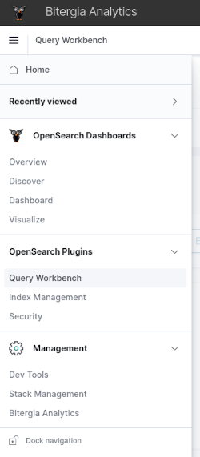
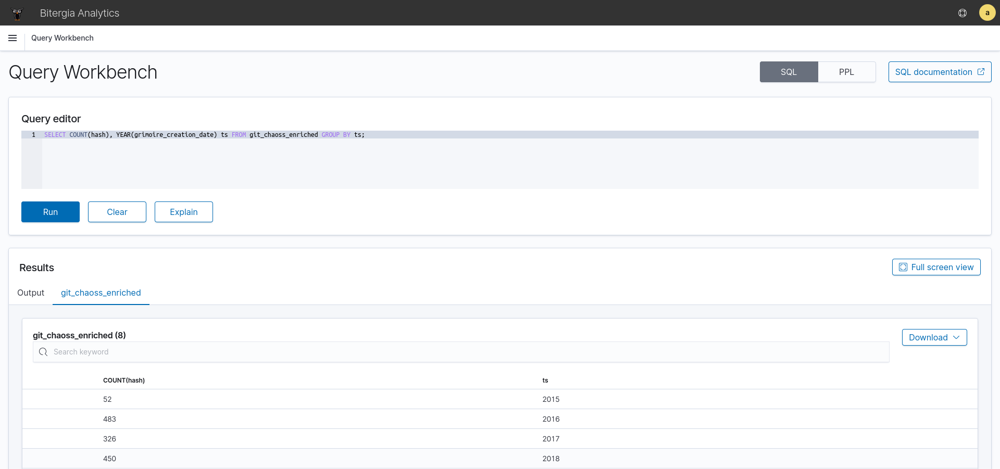

# OpenSearch SQL

As an alternative to [OpenSearch DSL](https://opensearch.org/docs/latest/opensearch/query-dsl/index/),
you can use [SQL](https://en.wikipedia.org/wiki/SQL) language to run searches,
obtain metrics, or generate reports. This is provided by a OpenSearch plugin that is
enabled on our standard deployments.

### SQL Language

The SQL language is perfect for beginner users to the platform because its syntax is
simpler and easier to learn than OpenSearch DSL. It's also the perfect option for those
that don't want to use the visualizations or dashboards to get their metrics. For
example, in order to obtain the metric `number of commits by year`, you would just run
the query

```
SELECT COUNT(hash), YEAR(grimoire_creation_date) ts FROM git_chaoss_enriched GROUP BY ts;
```

and save the results in any of the available formats: JSON, CSV, or text.

### Query Workbench tool

Queries can be run directly from the dashboard using the
[Query Workbench tool](https://opensearch.org/docs/latest/search-plugins/sql/workbench/).
To do it, go to the `Query Workbench` section on the left menu of the BAP dashboards.



Write your query on the text box and click on `Run` button. The results will appear on
the lower section of the page. You can export the data in different formats (JSON, CSV,
...) clicking on the button `Download` once the query was successful.



You can also run queries using the
[SQL command-line client](https://opensearch.org/docs/latest/search-plugins/sql/cli/)
or the [API](https://opensearch.org/docs/latest/search-plugins/sql/protocol/).

## Limitations and more information

Although SQL is a powerful language, it wasn't designed for documental databases, like
OpenSearch, so the current implementation available in the platform is
[limited](https://opensearch.org/docs/latest/search-plugins/sql/limitation/) and doesn't
support all the capabilities of SQL.

You can also learn more about this SQL support on
[the official documentation](https://opensearch.org/docs/latest/search-plugins/sql/index/)
of OpenSearch project.