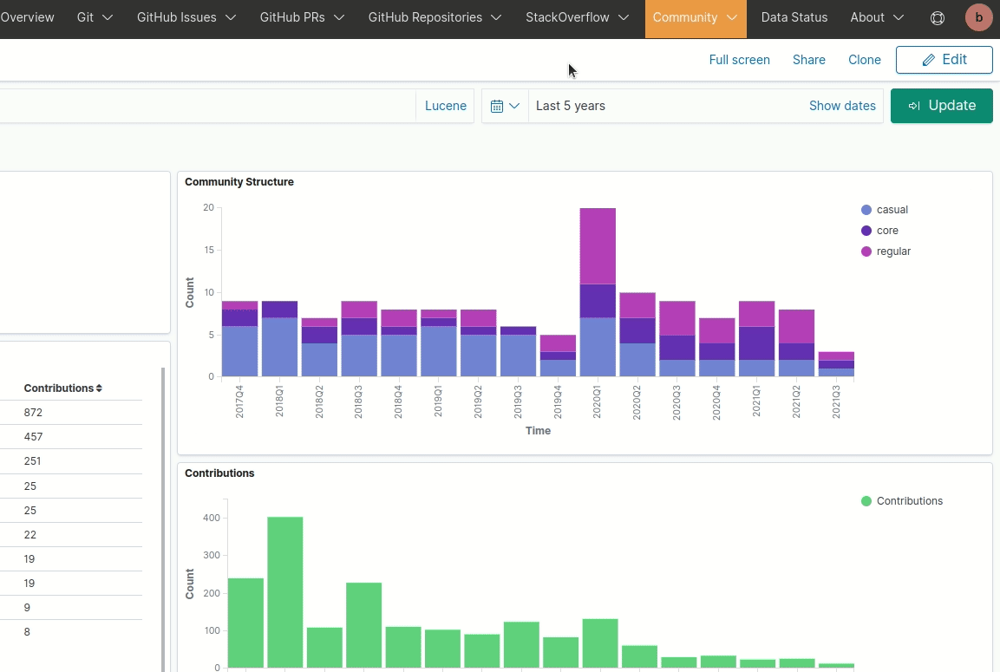
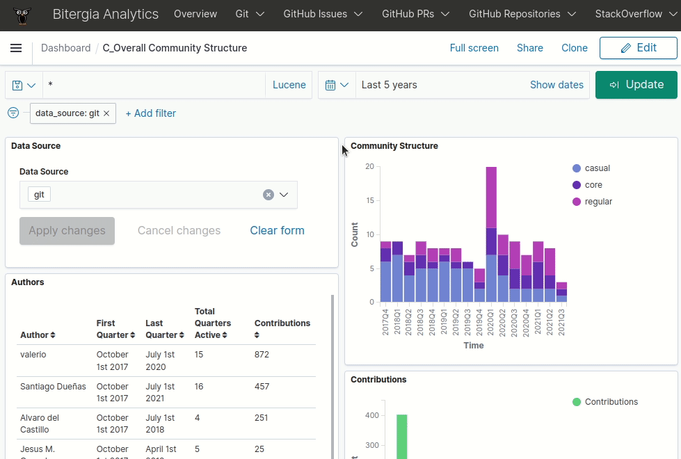
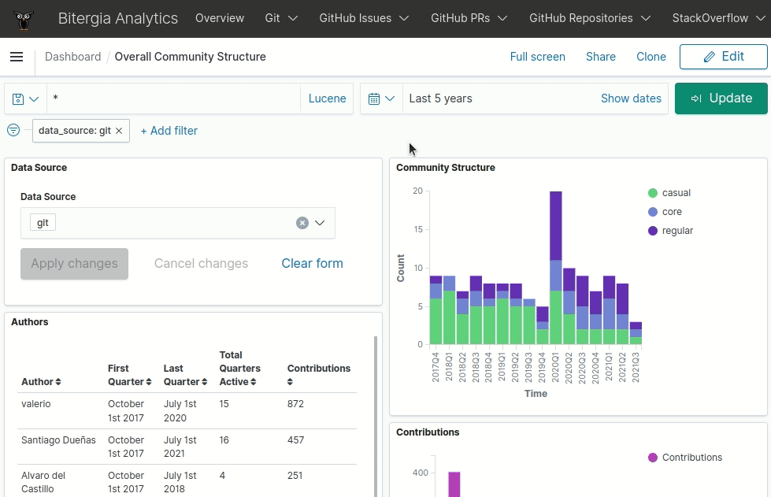
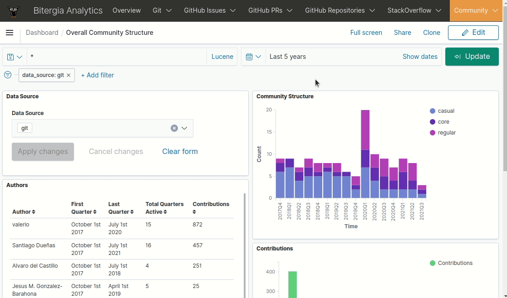
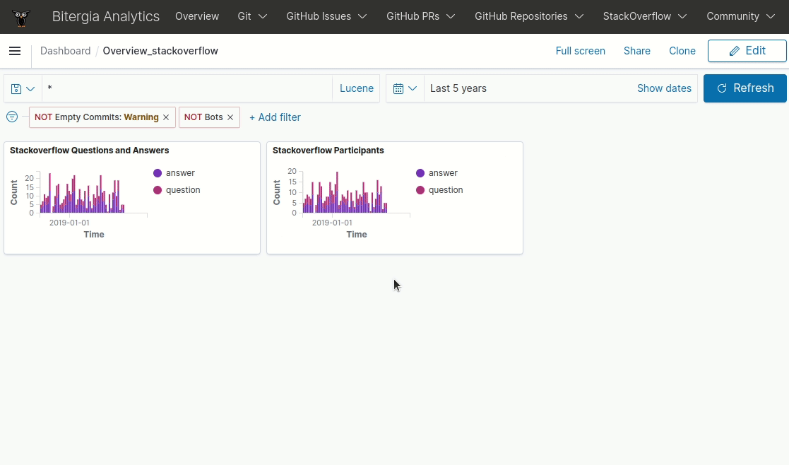
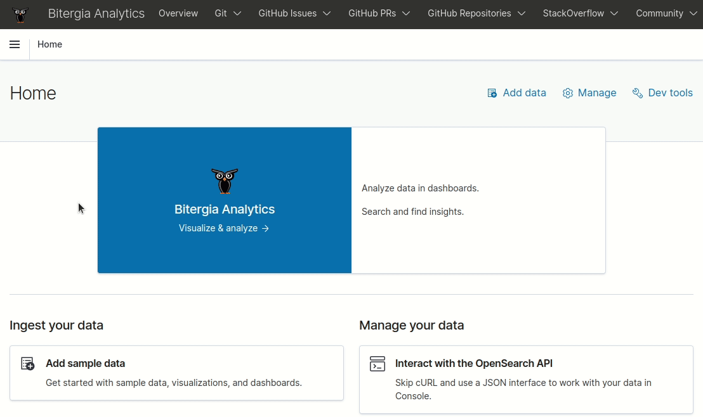

# Custom visualizations

## Saving new dashboards or visualizations

Standard dashboards provided by Bitergia offer a lot of information, however, you may
wish to create your own visualizations or/and dashboards or edit some of the existing
ones.

The steps to create custom content are:

  - Click on `Edit`
  - Click on `Save`
  - Make sure `Save as new dashboard` or `Save as new visualization` toggle button is on.
  - Give your dashboard or visualization a descriptive name.

## Editing visualizations

  - [Login to the dashboards](../new/reporting_and_sharing.md#how-to-login).
  - Click on the `Edit` tab in the top right corner (gears should appear in the top
    right corner of each visualization).
  - Click on the `gear` icon of the target visualization.
  - Click on `Edit visualization`.
  - Follow the
    [saving new dashboards or visualizations](#saving-new-dashboards-or-visualizations)
    instructions if you are editing an existing dashboard/visualization not originally
    created by you. If you are modifying your own object, just overwrite it by clicking
    on the button `Save` in the top right corner.

## Renaming visualizations

  - [Login to the dashboards](../new/reporting_and_sharing.md#how-to-login).
  - Click on the `Edit` tab in the top right corner (gears should appear in the top right
    corner of each visualization).
  - Click on the `gear` icon of the target visualization.
  - Click on `Customize panel` and change the title.
  - Once done, follow the
    [saving new dashboards or visualizations](#saving-new-dashboards-or-visualizations)
    instructions if you are editing an existing dashboard/visualization not originally
    created by you. If you are modifying your own object, just overwrite it by clicking
    on the button `Save` in the top right corner.

## Creating visualizations

  - [Login to the dashboards](../new/reporting_and_sharing.md#how-to-login).
  - Click on the `Edit` tab in the top right corner.
  - Click on `Create new`.
  - Select a visualization type.
  - Select a source (index pattern) to create your visualization on top of it.
  - Configure the visualization (metrics, buckets...).
  - Once you have finised you visualization, click on `Update` and then `Save`.
  - Type the name of the new visualization and click on `Save and return`. Remember to
    start the name of your custom visualization with `C_`.

## Editing a dashboard

  - [Login to the dashboards](../new/reporting_and_sharing.md#how-to-login).
  - Go to the target dashboard.
  - Click on the `Edit` tab in the top right corner.
  - Click on the `Add` tab in the top right corner.
  - Create a new visualization or load an existing one.
  - Once done, the visualization will be visible on the dashboard.
  - Move/resize the visualizations in the dashboard, set filters and time picker
    (optionally).
  - Once done, follow the
    [saving new dashboards or visualizations](#saving-new-dashboards-or-visualizations)
    instructions if you are editing an existing dashboard/visualization not originally
    created by you. If you are modifying your own object, just overwrite it by clicking
    on the button `Save` in the top right corner.

## Creating dashboards

  - [Login to the dashboards](../new/reporting_and_sharing.md#how-to-login).
  - Open the left-side sidebar.
  - Go to the `Dashboard` section.
  - Click on the `Edit` tab in the top right corner.
  - Select `Add an existing` or create a new visualization.
  - Select the visualizations that you want to add.
  - Configure using the time picker the perior that you want to visualize.
  - Once done, click on the button `Save` on the top right corner.
  - Set the title and description of the new dashboard. Remember to start the name of
    your custom dashboard with `C_`.

