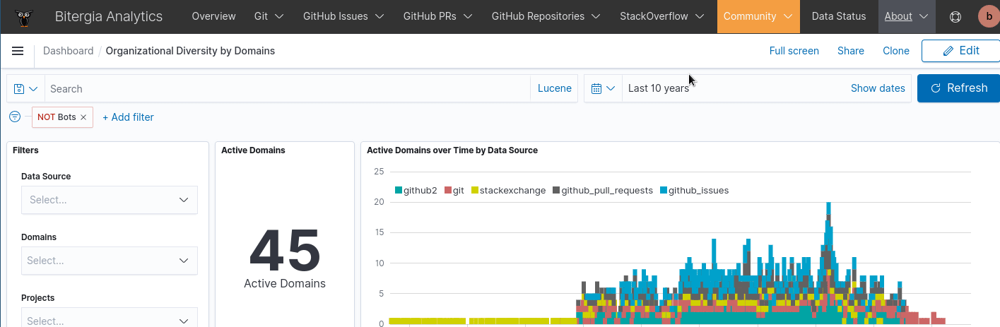
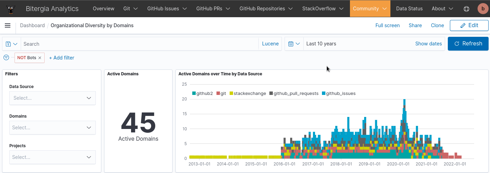
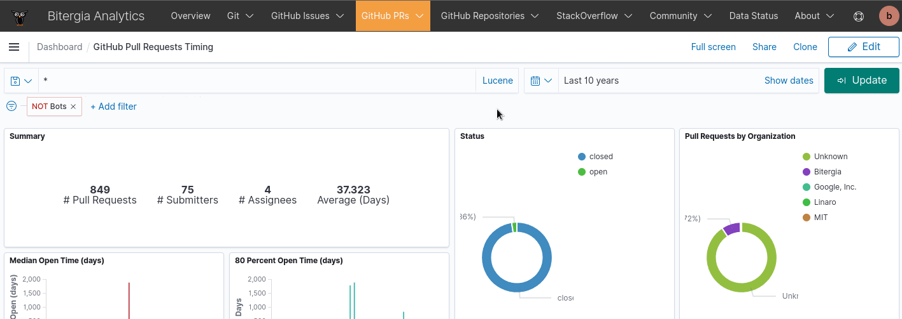
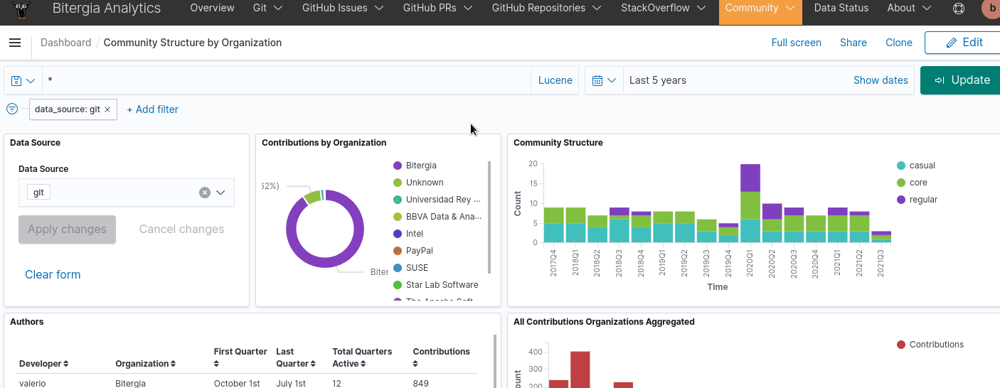

# BAP Quick start

With this quick start you can learn the basic navigation inside the Bitergia Analytics
Platform in less than 2 minutes:

## Navigation

On the top bar, you have all your dashboards, generally sorted by
[datasources](../supported/index.md#Index)

## Date range

On the top right corner, you can filter the time that you want to analyze

## Item filter

A lot of visualizations allow filtering (in and out) by values you are interested in.

## Pin filter

TIP: You can pin your filters across to use them in other dashboards

