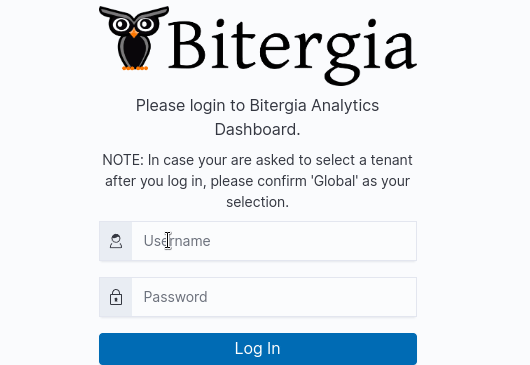
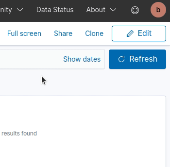
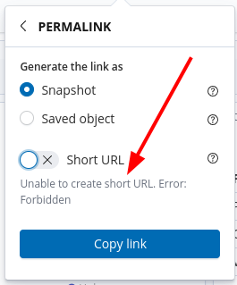

# Reporting and sharing

## How to login

To perform some actions you will need to log in to your dashboard.
If your dashboard is private, you will get the login form once you enter your
dashboard (usually `yourcompany.biterg.io`)

If your dashboard is public, you have to log in by clicking on the top right corner
and then switching to your account.

## Sharing a dashboard

The data presented in pre-configured dashboards can be filtered by the user to suit the
purpose of a particular analysis. The dashboard showing filtered data and adapted
visualizations can be further shared and bookmarked. 

Anyone using the shared link or the bookmark will have access to the same view (filters
included) shown when the link or bookmark was created.

To create a link to share or bookmark, click on the "share" icon on the top right side of
the dashboard.

There are three options to share the results of the analysis shown on the saved dashboard

- full URLs called `permalink` (which are long and a bit cumbersome to handle);
- shortened  URLs encode the same information but are much easier to deal with;
- code snippet to embed in a web report (you can also select which sections you want to
  include in the embedded frame) 

### Snapshot vs. Saved Object

“Snapshot” is the specific current status (with filters and other tweaks applied)... of a
dashboard that can be further explored and adopted for analysis purposes. Such a shared
dashboard won’t be affected if the original dashboard evolves.

#### Saved Object

Choose Saved Object if you want your recipient to access the latest saved version of a
dashboard.

**Note:** Only users who have writing credentials also have the possibility to save a
short version of the shared URL or snippet. If you do not have writing permission, you
will see the following error:

