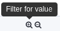
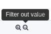
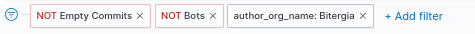
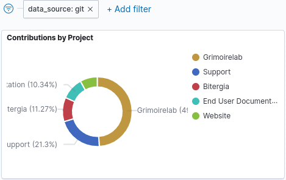
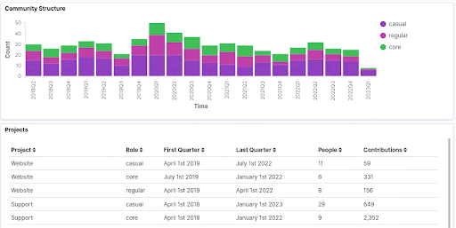
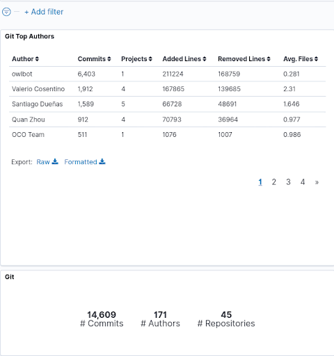
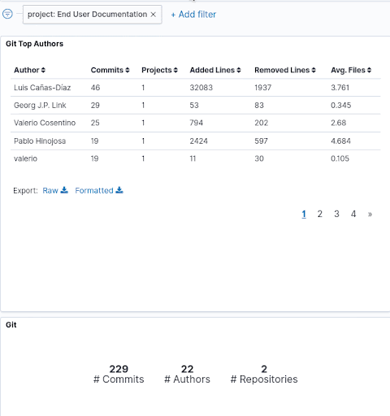
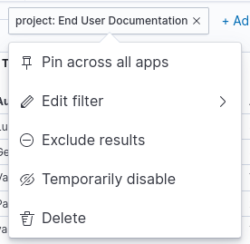
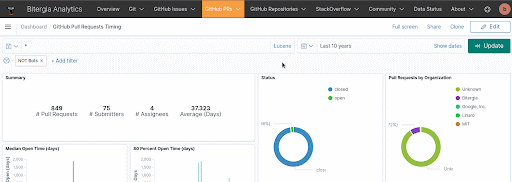
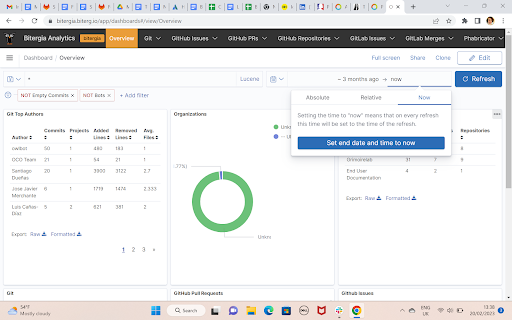

# Search your data

There are several ways of searching your data in Bitergia Analytics, all inherited from
OpenSearch. You can filter by using the search bar and by using filters. We recommend
using filters because they are more user-friendly. You can find below some tips to make
the most of them.

Filter are powerful, there are several reasons to use them:

  - **Compare** groups of data.
  - **Zoom in** on details.
  - **Filter out** excessive, unwanted, or irrelevant data.
  - **Drill down** until you get the level of detail you want.
  - **Investigate** the reasons for anything that may have caught your attention.
  - **Limit and specify** the analysis timeframe.

If something you see in a visualization calls your attention, you want to find out more
about it. Other times you have a question, and you know that the answer can be found by
drilling down into the data.The usual way to do that is to apply conditions to your data
to include the data you want while excluding unwanted or irrelevant ones. By applying
condition over the condition, you zoom in more and more. As you narrow your scope, other
details become more apparent until you have a curated set of data that provides answers.


A trivial case is when you trim the displayed timeframe to focus your analysis on it.
You might start from a view over several years, but focusing on several months, you see
what happened every week, and if you zoom in again, you display their daily events.


## Fundamentals

### Filtering IN
The plus icon in magnifying glass filters separate the items that fulfill a condition and
those that do not. You can include the ones that do in the visualization and hide those
that don’t.




### Filtering OUT
However, the platform also gives you an option to do the opposite meaning: hide the
results that fulfill the required condition and show those that don’t




### Filters Display
Filters appear as red or gray actionable boxes on the top left part of the dashboard,
right below the search bar.




### Default Filters

In visualizations dealing with commits, we have applied two filters by default **NOT
empty commits** and **NOT bots**.


### Filter Application Scope

Each filter only affects the visualizations compatible with it. Logical relation is not
enough. The data need to be linked. It refers both to the dashboard you create the filter
at and those you navigate to while your filter is pinned.


### Empty Dashboard

You can combine different filters. If you get an empty dashboard, it is usually because
of a too-restrictive combination of filters.

**Note:** Your filtering tweaks are only active as long as you remain at the same
dashboard. If you switch to a different dashboard, you lose them unless you pin them (see
below).

**Note:** You can later reproduce your filtered dashboard with all the details you have
drilled down by saving the URL.


## There Are Four Ways to Apply a Filter


### Clicking Directly on a Sector in Pies or a Bar in Bar Charts

For instance, if we click on an organization on the doughnut breakdown, a filter appears
on the filter list just below the search field. The rest of the **visualizations change
accordingly** as the data is filtered.




### Hovering over the Value in a Table and Clicking the Minus or the Plus Sign inside the Magnifying Glass

Some visualizations show values. Some of them are filterable some are not. You can filter
those filterable ones by hovering over the value and clicking on the pop-up offering you
the **plus and minus signs**.

Plus means to include the requested data. Minus means to exclude the requested data.




### Using Add Filter

The `Add filter` link next to the filter list opens a pop-up window in which you can
define a condition for filtering data items.

If you are new to the user interface, see if you can edit an existing filter or use it as
inspiration before creating a new one. The editing form is the same as the one you’ll use
to create a new one.

Creating a filter starts with selecting the kind of items you want to filter. For
example... git commits. Then the field, the condition operator and the criteria define
the filter.




### Enabling a Disabled Filter

If you have a disabled filter you can enable it.




## Five Operations Possibly Performed on a Filter

There are four options available when you click on the applied filter box.




### Pin Across All Dashboards

If you want to switch to a different dashboard but keep the filter you applied in the previous one so that it affects the new visualizations, there’s a possibility to pin filters.

**Note:** You’ll need to pin (or unpin) each filter separately.

**Note:** If you pin a filter or filters, they will remain active while navigating to other dashboards, affecting their visualizations.


### Edit Filter

Modify the parameters of the filter or customize the label.


### Invert the filter (Include results / Exclude results)

Modify the filter to include or exclude the search. A typical example is to filter by the
activity of a company to see how active it is and modify the filter to exclude its
activity to see how active the project is without that company.


### Temporarily disable

You can temporarily turn off the filter without losing it to re-apply it when needed.


### Delete

There is a difference between the option of deleting the filter and disabling it. You can temporarily disable the filter without losing it so that you can re-apply it when needed. On the other hand, once you delete the filter it cannot be re-applied, so you’ll need to create it again.




## Time filter

In the top right corner, you can find the date filter. It allows you to select the time
period for the visualization. Only items in that time period will be shown. So, for
example, the total count of commits, or the evolution of issues created over time,
corresponds only to commits authored or to issues created during that period.

Date filters can also be defined by clicking on bars on time-based charts or by selecting
(clicking and dragging) a group of them.



Relative timeframe mode displays the number of minutes, hours, days, weeks, or years ago
something happened.

Absolute timeframe mode displays the exact date and time something happened.

By default the time filter applies to the date of creation of the data items. But some
visualizations might be explicitly defined to apply the time filter over other time
fields like the closing date.


## Usual Fields for Filtering

The Data Model is a standard and extensible collection of schemas (entities, attributes,
relationships) used to build each standard visualization in Bitergia Analytics Platform.
The schemas represent real-world data source concepts (like pull-request) and activities
(like to commit) with well-defined semantics to facilitate data interoperability.
Examples of entities include:

`name`, `type` , `author`, `repository`, `geolocation`, etc.

Every supported data source has a data model that is used for the indexes and panels in
GrimoireLab. The fields described in each data model are the fields that are expected
from OpenSearch after the enrichment process.

You can check out the data models of the supported data sources in the
[Supported Data Sets](../supported/index.md) section.

The fields most used in filtering are common to all data sources:

`author_*` fields are properties of the author of the items filtered (commits, issues,
pull requests):

  - `author_org_name` is the name of the organization the author was affiliated to when
    (s)he created the item. But people with common names (John Smith) might share the
    same name. In order to separate them, there’s a field author_uuid unique to each
    individual profile.
  - `author_bot` is a field telling if the author has been identified as a bot. It is
    usually used to filter out their activity and focus on the human-driven one.
  - Being interested in the work of a specific person is a less frequent case, but
    sometimes it happens. Mostly, a user looking for his own trace in the system.
    `author_name is the name of the author.

Another usual topic for filtering contributions is where they belong.

  - On BAP instances having many projects, you may want to distinguish the work related
    to a specific one or to a certain set of projects. For that, you’ll find the field
    `project` in data originated in most of the data_sources.
  - In contrast, filtering by repository can be tricky because the field names and
    contents differ depending on the data source. So, if you want to filter by the
    repository in dashboards mixing different data sources, or pinning across dashboards,
    you’ll need to create several filters.
    - Git commits have a `repo_name` field holding the full URL, including the “.git”
      extension.
    - GitHub issues or pull requests have two fields: `repository` and `github_repo`.
      None of them include the “.git” extension. The former stores the URL, and the
      latter only the “organization/repository” segment.
    - Other data sources have their own nuances.

Other data source-specific fields usually used for filtering include:
 - `state` for GitHub issues and pull requests, to distinguish open ones vs. closed ones.
 - `file_dir_name` for git_areas_of_code when you want to see what happened on a specific
   directory.

## Filtering many values at once

Sometimes you need to filter a group of values. In the user interface you'll then select
the `is one of` operator when defining the filter and select the values to be filtered.

If you need to select many values this method may become uncomfortable. Alternatively,
you can also click on "Edit as Query DSL" instead, and feed a query code like this:

```json
{
  "query": {
    "bool": {
      "filter": {
        "terms": {
          "my_field": [
             "a_value",
             "another_value",
             ...etc
          ]
} } } } }
```
